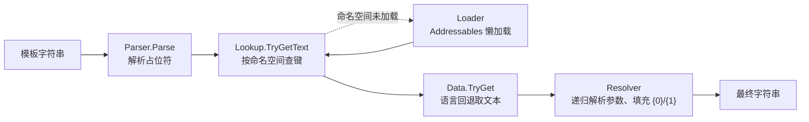
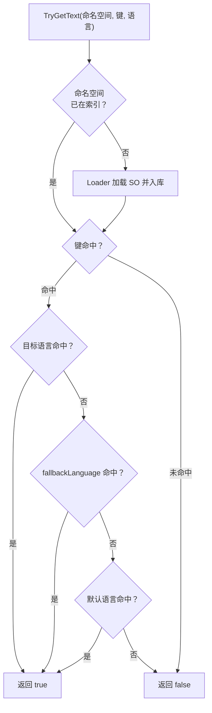
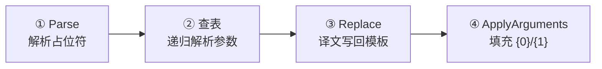

# Runtime 技术说明

**简体中文**

本文面向需要理解、使用或扩展本包运行时部分的开发者，讲解 `Runtime/` 下的全部代码。读完本文，你应当能够：

- 清楚一条本地化模板从输入到输出的完整链路；
- 知道每个类型的职责边界，以及分层设计的理由；
- 在自己的代码中正确初始化、切换语言、取词，并避开常见的坑。

## 目录

1. [总览](#1-总览)
2. [数据层：Runtime/Data](#2-数据层runtimedata)
3. [系统层：Runtime/System](#3-系统层runtimesystem)
4. [工具层：Runtime/Utility](#4-工具层runtimeutility)
5. [端到端示例：一条模板的解析过程](#5-端到端示例一条模板的解析过程)
6. [使用指南](#6-使用指南)
7. [设计要点与注意事项](#7-设计要点与注意事项)

***

## 1. 总览

### 1.1 Runtime 在包中的位置

本包分为 Runtime 与 Editor 两层。Editor 负责把 CSV/XLSX 源表转换、校验并注册成 Addressables 资产；Runtime 则只关心三件事：

1. **存**：多语言词条以什么结构存放（`Runtime/Data`）；
2. **查**：运行时如何按命名空间和键找到文本，并处理语言回退（`Runtime/System`）；
3. **解**：如何解析 `<UI|START_GAME>` 这类模板占位符并填充参数（`Runtime/Utility`）。

三层单向依赖：System 依赖 Data 与 Utility，Data 与 Utility 之间互不依赖。

### 1.2 一次查询的完整旅程

调用方拿到的是一段“模板字符串”，例如：

```text
点击 <UI|START_GAME> 开始游戏，当前玩家：<UI|WELCOME(<UI|PLAYER_NAME>)>
```

它在 Runtime 内部的流转如下：



`LocalizationSystem` 是这个系统的门面：外部只需要调用这一个类就可以了，其余的模块都被设为了`internal`。

### 1.3 模块地图

| 文件                                        | 层  | 可见性      | 一句话职责                                         |
| ----------------------------------------- | -- | -------- | --------------------------------------------- |
| `Data/LocalizationData.cs`                | 数据 | public   | 一条词条：键 + 多语言文本数组 + 注释，含语言回退取值                 |
| `Data/LanguageDataSO.cs`                  | 数据 | public   | 一张命名空间化的语言表（ScriptableObject）                 |
| `Data/LanguageDataLoader.cs`              | 数据 | internal | 经 Addressables 同步/异步加载 `LanguageDataSO`，带三层缓存 |
| `System/LanguageConfigSO.cs`              | 系统 | public   | 项目支持哪些语言、默认语言、各自的回退语言                         |
| `System/LocalizationLookup.cs`            | 系统 | internal | 二级字典索引（命名空间 → 键 → 词条），懒加载与回退查询                |
| `System/LocalizationSystem.cs`            | 系统 | public   | 门面：持有配置与索引，切换语言，对外提供取词入口                      |
| `Utility/LocalizationPlaceholder.cs`      | 工具 | public   | 描述一个已通过语法校验的占位符（只读 struct）                    |
| `Utility/LocalizationTemplateParser.cs`   | 工具 | public   | 基于 Superpower 的模板解析器，纯文本处理，不碰 Unity 对象        |
| `Utility/LocalizationTemplateResolver.cs` | 工具 | internal | 递归解析占位符并应用 `{0}` 参数                           |
| `Utility/LocalizationKeyUtility.cs`       | 工具 | public   | 键命名规则校验与规范化                                   |

### 1.4 程序集与外部依赖

所有 Runtime 代码位于单一程序集 `Dotline.Localization`（`Runtime/Dotline.Localization.asmdef`），依赖：

- `Unity.Addressables` / `Unity.ResourceManager`（package.json 声明 `com.unity.addressables: 1.22.3`）；
- `Superpower 3.2.1`（预编译 DLL，位于 `Runtime/Plugins/Superpower.3.2.1`），用于模板解析。

Runtime 内部有两个 `internal` 类型（`LocalizationLookup`、`LanguageDataLoader`），外部调用方不可见——这是刻意设计：查找与加载属于实现细节，公开 API 只保留 `LocalizationSystem` 一条入口。

***

## 2. 数据层：Runtime/Data

### 2.1 LocalizationData —— 一条词条

`LocalizationData.cs` 定义了两个可序列化 struct。词条的文本主体是一个“语言代码 → 文本”的数组：

```csharp
[Serializable]
public struct LocalizationText
{
    public string languageCode;
    public string text;
}

[Serializable]
public struct LocalizationData : IEquatable<LocalizationData>
{
    public string key;
    public LocalizationText[] texts;
    public string comment;
}
```

一条词条就是：键 `key` + 各语言文本 `texts` + 可选注释 `comment`。

`texts` 按源表的语言列逐列展开——一种语言对应数组中的一项。以 `zh-Hans` / `zh-Hant` / `en` 三语配置为例，词条 `START_GAME` 的 `texts` 内容为：

| 字段                    | 类型 / 语言   | `text`     | 说明                   |
| --------------------- | --------- | :--------- | -------------------- |
| `key`                 | `string`  | <br />     | 词条键，命名空间内唯一，大写蛇形命名   |
| `LocalizationText[0]` | `zh-Hans` | 开始游戏       | 中文（简）文本              |
| `LocalizationText[1]` | `zh-Hant` | 開始遊戲       | 中文（繁）文本              |
| `LocalizationText[2]` | `en`      | Start Game | 英文文本                 |
| `comment`             | `string`  | <br />     | 可选注释，仅源表维护用，不参与运行时查询 |

词条本身由 Editor 端从 CSV/XLSX 源表生成，不关心项目语言清单——某种语言缺失时，由查询侧的回退链处理（见下文 `TryGet`）。

**语言回退发生在词条内部**。`TryGet` 的取值策略分两步：

```csharp
public bool TryGet(string languageCode, string defaultLang, out string result)
{
    result = string.Empty;
    if (texts == null || texts.Length == 0)
        return false;
    // 第一步：先用默认语言文本"打底"
    foreach (var localizationText in texts)
    {
        if (localizationText.languageCode == defaultLang)
            result = localizationText.text;
    }
    // 第二步：精确匹配目标语言
    foreach (var localizationText in texts)
    {
        if (localizationText.languageCode != languageCode) continue;
        result = localizationText.text;
        return true;
    }

    return false;
}
```

注意一个微妙但实用的行为：即使目标语言缺失、方法返回 `false`，`result` 里也已经装入了默认语言的文本。也就是说调用方拿到的永远是“当前能给出的最好结果”，返回值只告诉你这个结果是否精确匹配。各情形汇总：

| 场景                    | 返回值     | `result` 内容 |
| --------------------- | ------- | ----------- |
| `texts` 为 `null` 或空数组 | `false` | 空字符串        |
| 目标语言存在                | `true`  | 目标语言文本      |
| 目标语言缺失，默认语言存在         | `false` | 默认语言文本（兜底）  |
| 目标语言与默认语言都缺失          | `false` | 空字符串        |

`LocalizationData` 同时实现了 `Equals`/`GetHashCode`（按 `key`、`texts`、`comment` 比较），供 Editor 端做增量转换时判断资产内容是否变化。注意其中的 `texts` 是**数组引用比较**——两次反序列化出的内容相同的数组引用并不相等，依赖它做词条去重时需留意。

### 2.2 LanguageDataSO —— 命名空间化的语言表

`LanguageDataSO.cs` 是承载词条的 ScriptableObject，每个实例对应一个**命名空间**（可以理解为一个模块、一个 UI 界面的文案集合）：

```csharp
[CreateAssetMenu(fileName = "LanguageData", menuName = "Localization/Language Data")]
public class LanguageDataSO : ScriptableObject
{
    public string sourceFilePath;                       // 源 CSV/XLSX 路径，仅作追溯
    [SerializeField] private string namespaceId;        // 显式命名空间，可为空
    public List<LocalizationData> entries = new();      // 词条列表
}
```

各字段的可见性与用途：

| 字段               | 可见性                          | 说明                                                  |
| ---------------- | ---------------------------- | --------------------------------------------------- |
| `sourceFilePath` | public                       | 源 CSV/XLSX 路径，仅作追溯，运行时不使用                           |
| `namespaceId`    | private，经 `NamespaceId` 属性读取 | 显式命名空间，可为空                                          |
| `entries`        | public                       | 词条列表，运行时查询的数据主体                                     |
| `legacyCsvFile`  | public（`HideInInspector`）    | 旧版 CSV 直接引用，`FormerlySerializedAs("csvFile")`，仅兼容保留 |

命名空间的解析逻辑在 `NamespaceId` 属性中，按固定优先级取值：

| 优先级 | 来源               | 条件与说明                                                      |
| --- | ---------------- | ---------------------------------------------------------- |
| 1   | `namespaceId` 字段 | 非空时直接返回首尾裁剪后的值                                             |
| 2   | 资产名 `name`       | 字段为空时回退；此时静态字典 `NamespaceCache` 记录“资产名 → 实例”映射，发现同名不同实例即告警 |

```csharp
public string NamespaceId
{
    get
    {
        if (!string.IsNullOrEmpty(namespaceId))
            return namespaceId.Trim();

        if (NamespaceCache.TryGetValue(name, out var resource))
        {
            if (resource != this)
                Debug.LogWarning($"{name} 命名空间不唯一");
        }
        else
            NamespaceCache.Add(name, this);

        return name.Trim();
    }
}
```

`legacyCsvFile` 仅为旧资产兼容保留，运行时不读取，新数据一律走 `entries`。

### 2.3 LanguageDataLoader —— Addressables 加载与三层缓存

`LanguageDataLoader.cs` 是 internal 静态类，职责单一：**按地址把** **`LanguageDataSO`** **从 Addressables 里取出来**。它维护三个静态缓存字典（键均按 `OrdinalIgnoreCase` 比较，进程内常驻）：

| 缓存字典                | 键    | 值                                      | 作用                 |
| ------------------- | ---- | -------------------------------------- | ------------------ |
| `CachedHandles`     | 实际地址 | `AsyncOperationHandle<LanguageDataSO>` | 句柄复用，防止重复加载，支持统一释放 |
| `CachedResources`   | 实际地址 | `LanguageDataSO`                       | 已加载资产，命中即跳过加载      |
| `ResolvedAddresses` | 请求名  | 实际 Addressables 地址                     | 地址探测结果，避免重复探测      |

对外只有两个加载入口，行为逐段对齐（先解析地址、再查缓存、最后加载资产）：

| 入口                      | 签名                                    | 失败表现                      | WebGL 支持             |
| ----------------------- | ------------------------------------- | ------------------------- | -------------------- |
| `TryLoadDataResource`   | `(string, out LanguageDataSO) → bool` | 返回 `false` 并输出 `LogError` | 编译期排除，直接报错返回 `false` |
| `LoadDataResourceAsync` | `string → Task<LanguageDataSO>`       | 返回 `null` 并输出 `LogError`  | 唯一可用路径               |

异步版是给 WebGL 准备的——同步路径在 WebGL 上被编译期排除：

```csharp
#if UNITY_WEBGL && !UNITY_EDITOR
            Debug.LogError(
                $"[Localization] Cannot synchronously load Addressable language data '{requestedAddress}' on WebGL. " +
                $"Use {nameof(LoadDataResourceAsync)} instead.");
            return false;
#else
            // 同步：先解析地址，再等 handle 完成
#endif
```

加载分为“解析地址”和“加载资产”两步。**地址解析**会把调用方给的宽松名字展开成多个候选地址逐一探测，探测用的是 `LoadResourceLocationsAsync`（只查位置、不加载资产，用完即释放）：

```csharp
private static string[] BuildAddressCandidates(string requestedAddress)
{
    if (requestedAddress.IndexOf('/') >= 0 || requestedAddress.IndexOf('\\') >= 0)
    {
        string normalized = requestedAddress.Replace('\\', '/');
        if (normalized.StartsWith("Assets/", StringComparison.OrdinalIgnoreCase))
            return new[] { normalized };                       // 已是资产路径

        return new[] { normalized, $"Assets/Resources/{AppendAssetExtension(normalized)}" };
    }

    return new[]
    {
        requestedAddress,                                      // 裸名，按 Addressables 地址找
        $"Localization/{requestedAddress}",                    // 按命名空间约定地址找
        $"Assets/Resources/Localization/{AppendAssetExtension(requestedAddress)}"
    };
}
```

候选展开规则汇总：

| 输入形态              | 候选地址（按序探测，首个命中即用）                                                   |
| ----------------- | ------------------------------------------------------------------- |
| `Assets/` 开头的路径   | 原样使用                                                                |
| 含 `/` 或 `\` 的其他路径 | 原样 → `Assets/Resources/{路径}.asset`                                  |
| 裸名（如 `UI`）        | `UI` → `Localization/UI` → `Assets/Resources/Localization/UI.asset` |

也就是说，`"UI"`、`"Localization/UI"`、`"Assets/Resources/Localization/UI.asset"` 都能命中同一张表；探测结果缓存进 `ResolvedAddresses`，之后不再重复探测。

加载资产时，句柄存入 `CachedHandles` 后复用，失败时释放句柄并清理缓存；`TryGetCached` 判空用的是 Unity 重载的 `==`，能识别“资产已被 Destroy”的死缓存并自动剔除。`ReleaseCachedDataResources()` 提供整体卸载入口（遍历释放全部有效句柄并清空三个字典）。

***

## 3. 系统层：Runtime/System

### 3.1 LanguageConfigSO —— 语言清单

`LanguageConfigSO.cs` 是运行时使用的语言清单副本，描述“项目支持哪些语言”。源配置保存在 `ProjectSettings/DotlineLocalizationSettings.asset`，编辑器会把它烘焙到 `Assets/Resources/Localization/LanguageConfig.asset`，运行时由 `LocalizationSystem` 自动加载：

```csharp
public class LanguageConfigSO : ScriptableObject
{
    public string sourceFolderPath = "Assets/Editor/Text Files/Localization";
    public string soFolderPath = "Assets/Resources/Localization";

    public string defaultLanguage = "zh-Hans";
    public List<LanguageDefinition> languages = new()
    {
        new() { code = "zh-Hans", displayName = "简体中文", fallbackLanguage = "en" },
        new() { code = "zh-Hant", displayName = "繁體中文", fallbackLanguage = "zh-Hans" },
        // ...
    };
}
```

`code` 是查询时使用的语言代码；`displayName` 仅用于展示；`fallbackLanguage` 是这张表配置的**词条级回退**（见 2.1）。`GetDefinition` 把列表惰性地转成字典加速查询：

```csharp
public LanguageDefinition GetDefinition(string languageCode)
{
    if (_languageDict.Count == 0)
    {
        foreach (var language in languages)
            _languageDict[language.code] = language;
    }

    if (_languageDict.TryGetValue(languageCode, out var definition))
        return definition;

    Debug.LogWarning($"Language Code {languageCode} not found");
    _languageDict.TryGetValue(defaultLanguage, out definition);
    return definition;   // 查不到时退回默认语言（可能为 null）
}
```

传入未知语言代码不会抛异常，而是警告后退回默认语言的定义。同文件还定义了 `LanguageDefinition`（`code` / `displayName` / `fallbackLanguage` 三字段的 Serializable 类），它是贯穿整个运行时的“语言身份”对象。

### 3.2 LocalizationLookup —— 二级索引与懒加载

`LocalizationLookup.cs` 是查询的核心，internal、纯 C# 类（不依赖 MonoBehaviour 与场景状态，因此可在 EditMode 下直接单测）。数据结构是一个二级字典：

```csharp
private readonly Dictionary<string, Dictionary<string, LocalizationData>> _lookup =
    new(StringComparer.OrdinalIgnoreCase);   // 命名空间 -> (键 -> 词条)
```

两级键都使用 `OrdinalIgnoreCase` 比较；同一命名空间内出现重复键时，按加载顺序后者覆盖前者并报 `LogError`。

词条入库来自 `AddData(LanguageDataSO)`，空键会被跳过并警告。

查询入口 `TryGetText` 体现了整个模块最重要的特性——**懒加载**。当命名空间不在索引里时，先尝试经 `LanguageDataLoader` 加载并入库，而不是启动时全量加载：

```csharp
if (!_lookup.TryGetValue(nameSpace, out var dict))
{
    if (LanguageDataLoader.TryLoadDataResource(nameSpace, out var so))
    {
        AddData(so);
        dict = _lookup[nameSpace];
    }
    else
    {
        Debug.LogError($"[Localization] Unable to load namespace '{nameSpace}'");
        return false;
    }
}
```

找到词条后按**一级回退加默认语言**取文本：先目标语言，再该语言定义的 `fallbackLanguage`，最后尝试默认语言：

```csharp
if (dict.TryGetValue(key, out var data))
{
    if (data.TryGet(languageDefinition.code, _defaultLanguage, out result)) return true;
    if (data.TryGet(languageDefinition.fallbackLanguage, _defaultLanguage, out result)) return true;
    if (data.TryGet(_defaultLanguage, _defaultLanguage, out result)) return true;
}
Debug.LogWarning($"[Localization] No such key '{key}' or language '{languageDefinition.displayName}'");
return false;
```

整个查询流程（含懒加载、一级 fallback 与默认语言）如下图：



结合 2.1 的 `TryGet` 语义，完整回退顺序是：**目标语言 → 该语言的 fallbackLanguage → defaultLanguage**。不会继续追踪 fallbackLanguage 的 fallback；如果默认语言也没有该词条，查询返回 `false`。

此外，`LocalizationLookup` 还提供三个供 Editor 端使用的辅助查询：

- `ContainsKey(key, namespaceIds)`：先在指定命名空间序列里找，找不到再全局扫描；
- `GetNamespaces()`：列出已加载的全部命名空间；
- `GetEntries(namespaceId)`：列出某命名空间下的全部词条（副本）。

### 3.3 LocalizationSystem —— 门面

`LocalizationSystem.cs` 只有 40 行，是唯一对外的运行时 API。它是一个**可序列化的普通 C# 类**（不是 MonoBehaviour），由调用方（例如 Sample 中的 MonoBehaviour）持有并驱动：

```csharp
[Serializable]
public class LocalizationSystem
{
    public const string RuntimeConfigResourcePath = "Localization/LanguageConfig";

    private LocalizationLookup _lookup;
    private LanguageConfigSO _languageConfig;
    public LanguageDefinition CurrentDefinition { get; private set; }

    public Action OnLanguageChanged;

    public LocalizationSystem()
    {
        _languageConfig = Resources.Load<LanguageConfigSO>(RuntimeConfigResourcePath);
        _lookup = new LocalizationLookup(_languageConfig.defaultLanguage);
    }
}
```

构造时不需要外部传入 `LanguageConfigSO`；系统会固定从 `Resources/Localization/LanguageConfig` 读取烘焙后的运行时配置。默认语言随之传给 `LocalizationLookup`，作为词条级回退的“打底”语言。

切换语言带去重保护——相同语言不重复广播：

```csharp
public void SetLanguage(string languageCode)
{
    var newDefinition = _languageConfig.GetDefinition(languageCode);
    if (newDefinition == null)
    {
        Debug.LogWarning($"[LocalizationSystem] Cannot set language {languageCode} ...");
        return;
    }

    if (newDefinition != CurrentDefinition)
    {
        CurrentDefinition = newDefinition;
        OnLanguageChanged?.Invoke();
    }
}
```

取词只有一行：把模板、当前语言定义、查找器交给解析器：

```csharp
public string GetLocalizedText(string template)
{
    return LocalizationTemplateResolver.Resolve(template, CurrentDefinition, _lookup);
}
```

> **重要**：`CurrentDefinition` 初始为 `null`。构造后必须先调用一次 `SetLanguage`（例如用系统语言初始化），再调用 `GetLocalizedText`，否则查询会在空引用上失败。

***

## 4. 工具层：Runtime/Utility

### 4.1 模板语法速查

在讲解析器之前，先记住模板语法的全貌：

```text
<命名空间|键>                        无参数占位符
<命名空间|键(参数1, 参数2)>           带参数占位符，参数填入译文的 {0}/{1}
<命名空间|键(<命名空间|键2>)>         参数可以是嵌套占位符
<命名空间|键("文本,带逗号")>          文本参数必须用双引号包裹
```

- 命名空间必须**显式声明**，用 `|` 与键分隔；
- 命名空间与键的首尾空白会被裁剪；
- 键遵循大写蛇形命名规则（见 4.5）；
- 解析失败的片段**原样保留**，TMP 富文本标签和用户正文不会被破坏。

### 4.2 LocalizationPlaceholder —— 占位符的数据模型

`LocalizationPlaceholder.cs` 是只读 struct，描述一个“已通过语法校验”的占位符：

```csharp
public readonly struct LocalizationPlaceholder : IEquatable<LocalizationPlaceholder>
{
    public int StartIndex { get; }   // '<' 在原模板中的索引
    public int EndIndex { get; }     // '>' 在原模板中的索引（含）
    public string RawContent { get; }      // 尖括号内未裁剪的原始文本
    public string NamespaceId { get; }     // 显式命名空间
    public string Key { get; }             // 裁剪后的键
    public string[] ArgumentText { get; }  // 参数文本数组；无参数为空数组

    public int Length => EndIndex - StartIndex + 1;
}
```

它把“位置”与“内容”都暴露出来：位置（`StartIndex`/`EndIndex`）供 Resolver 做字符串替换，内容供查表。`Equals` 只比较起止位置——同一模板中同一位置不可能出现两个占位符，因此该 struct 可以安全地作为 Resolver 内部结果字典的键。

### 4.3 LocalizationTemplateParser —— 基于 Superpower 的解析器

`LocalizationTemplateParser.cs` 是 public 静态类，纯文本处理、不触碰任何 Unity 对象，可以直接在 EditMode 测试里使用。底层使用 Superpower 组合子构建语法。

先看**占位符的语法定义**（组合子自上而下读非常清晰）：

```csharp
private static readonly TextParser<ParsedPlaceholder> PlaceholderParser =
    from openAngle in Character.EqualTo('<')
    from namespaceId in NamespacePrefixParser                 // 命名空间 + '|'
    from key in KeyParser                                     // 键
    from argumentText in ArgumentGroupParser
        .OptionalOrDefault(Array.Empty<string>())             // 可选的 (参数组)
    from trailingWhitespace in Character.WhiteSpace.IgnoreMany()
    from closeAngle in Character.EqualTo('>')
    select new ParsedPlaceholder(namespaceId, key, argumentText);
```

命名空间与键共用同一个字符集规则——除 `< > ( ) |` 之外的任意字符，至少一个；键额外要过 `IsLocalizationKey` 校验：先排除 `MISSING:`/`EMPTY:` 前缀（这两个是工具链生成的缺失标记，从文法层面杜绝“缺失标记被当成键再次解析”的自激循环），再走 `LocalizationKeyUtility` 的大写蛇形校验。

**参数组的解析**支持括号平衡，这是“参数里能再嵌占位符”的基础。平衡组的定义是递归的：

```csharp
private static TextParser<Unit> CreateBalancedParenthesisGroup()
{
    TextParser<Unit> parenthesisGroup = null;
    TextParser<Unit> content = Superpower.Parse.OneOf(
        QuotedStringGroup,                        // 引号字符串原样吞掉
        BalancedAngleGroup,                       // 尖括号组（TMP 标签）
        Superpower.Parse.Ref(() => parenthesisGroup),  // 递归的圆括号组
        Character.ExceptIn('<', '>', '(', ')', '"').Value(Unit.Value));

    parenthesisGroup =
        from openParenthesis in Character.EqualTo('(')
        from items in content.Many()
        from closeParenthesis in Character.EqualTo(')')
        select Unit.Value;
    return parenthesisGroup;
}
```

平衡尖括号组 `CreateBalancedAngleGroup` 的结构完全同构（尖括号递归自身），平衡圆括号组则额外允许内部出现完整的尖括号组——因此 `<UI|FOO(<UI|BAR>)>` 这种“参数里再套占位符”的写法才成立。

顶层扫描则是一个手写循环：从左到右找 `<`，能解析成合法占位符就记录，不能就跳过一整个平衡尖括号组（这正是 `<Color=red>` 之类 TMP 标签被原样放过的原因），连平衡组都不是就只前进一个字符：

```csharp
while (scanIndex < template.Length)
{
    if (template[scanIndex] != '<') { scanIndex++; continue; }

    TextSpan remaining = source.Skip(scanIndex);
    if (!TryParsePlaceholder(remaining, out ParsedPlaceholder parsed, out int length))
    {
        scanIndex += TryParseBalancedAngleGroup(remaining, out int invalidLength)
            ? invalidLength   // 跳过完整的尖括号组（如 TMP 标签）
            : 1;              // 无法配对则只前进一个字符
        continue;
    }
    // 记录占位符，前进到其结尾
}
```

参数字符串到手后，`ParseArguments` 按**顶层逗号**切分：维护引号、尖括号、圆括号三种深度状态，只有全部归零时的逗号才是分隔符；切出的每段再由 `TryParseArgument` 归一化，合法形式只有三种——双引号字符串（去掉外层引号）、完整嵌套占位符、不变文化下的数值。其余一律判为解析失败。

公开 API 有两个：

- `Parse(template)`：返回 `IReadOnlyList<LocalizationPlaceholder>`；
- `ContainsPlaceholder(template, key)`：检查模板任意嵌套层级中是否引用了某键，不执行查表。

### 4.4 LocalizationTemplateResolver —— 递归解析与参数填充

`LocalizationTemplateResolver.cs` 是 internal 静态类，把 Parser 与 Lookup 缝合起来。`Resolve` 分四个阶段：



**阶段一：解析出占位符**，没有占位符就直接原样返回：

```csharp
var placeholders = LocalizationTemplateParser.Parse(template);
if (placeholders.Count == 0) return template;
```

**阶段二：逐个查表并递归解析参数**。参数先于译文处理——参数里的嵌套占位符会被 `Resolve` 递归展开：

```csharp
foreach (var placeholder in placeholders)
{
    if (!lookup.TryGetText(placeholder.NamespaceId, placeholder.Key,
            languageDefinition, out var subtemplate))
        continue;
    var args = placeholder.ArgumentText;
    var argResults = new string[args.Length];
    for (int i = 0; i < argResults.Length; i++)
        argResults[i] = Resolve(args[i], languageDefinition, lookup);   // 递归

    var subResult = ApplyArguments(subtemplate, argResults);
    subResultDict[placeholder] = subResult;
}
```

查表失败的占位符直接跳过——它在最终输出里保持原样，便于肉眼发现问题。

**阶段三：把译文写回模板**。按占位符的原始内容构造旧串，用 `StringBuilder.Replace` 替换：

```csharp
var resultBuilder = new StringBuilder(template);
foreach (var placeholder in placeholders)
{
    if (subResultDict.TryGetValue(placeholder, out var subResult))
        resultBuilder.Replace($"<{placeholder.RawContent}>", subResult);
}
```

**阶段四：参数填充**。译文中的 `{0}`、`{1}` 用预编译正则匹配，索引越界时保留原占位符而不是替换成空：

```csharp
private static readonly Regex Regex =
    new(@"\{\s*(\d+)\s*\}", RegexOptions.Compiled, TimeSpan.FromSeconds(0.5));

private static string ApplyArguments(string template, params string[] args)
{
    return Regex.Replace(template, match =>
    {
        int index = int.Parse(match.Groups[1].Value);
        // 找不到对应参数时保留原占位符
        return (uint)index < (uint)args.Length ? args[index] : match.Value;
    });
}
```

`(uint)index < (uint)args.Length` 是一个惯用技巧：负数转 `uint` 后会变成超大值，一次无符号比较就同时完成了“非负 + 不越界”两种判断。

#### 分步示例：一层嵌套参数的完整递归

以两张表为例（当前语言 `zh-Hans`，全部精确命中）：

| 命名空间  | key           | zh-Hans         |
| ----- | ------------- | --------------- |
| `UI`  | `KILL_INFO`   | 击杀了 {0}，共 {1} 次 |
| `UI`  | `PLAYER_NAME` | 旅人              |
| `Num` | `KILLS`       | 42              |

输入模板：

```text
<UI|KILL_INFO(<UI|PLAYER_NAME>, <Num|KILLS>)>
```

每行代表一层递归，写出该层解析后的暂存内容：

```text
第 0 层  Resolve("<UI|KILL_INFO(<UI|PLAYER_NAME>, <Num|KILLS>)>")
         → "击杀了 {0}，共 {1} 次", args: <UI|PLAYER_NAME>, <Num|KILLS>

第 1 层  Resolve("<UI|PLAYER_NAME>")  → "旅人"，无参数、无 {n}  → 返回 "旅人"
第 1 层  Resolve("<Num|KILLS>")       → "42"， 同上           → 返回 "42"

第 0 层  参数就绪 ["旅人", "42"]
         → "击杀了 旅人，共 42 次"，写回模板
```

求值顺序由内向外：最深的占位符最先变成纯文本，外层拿到的参数永远是可直接填充的字符串。

#### 两个边界情况

主干与示例之外，`Resolve` 有两个刻意的取舍值得单独说明，分别对应阶段二与阶段三。

**边界一（阶段二）：递归只发生在参数上，查表结果不会再被解析。**`Resolve` 的占位符清单来自对**输入模板**的一次 `Parse`；之后查表得到的译文（`subtemplate`）只会经历 `{0}` 参数填充，就直接作为最终文本写回，全程不会再 `Parse` 一次。对照两种写法（设表中 `CONFIRM` 的译文为 `确认`）：

```text
❌ 嵌套写在表格译文里：
   表：TIP  =  "按 <UI|CONFIRM> 继续"
   模板：<UI|TIP>
   输出：按 <UI|CONFIRM> 继续     ← 译文不被解析，CONFIRM 原样残留

✅ 嵌套写在模板的参数位置：
   表：TIP      =  "按 {0} 继续"
   模板：<UI|TIP(<UI|CONFIRM>)>
   输出：按 确认 继续              ← 参数被递归解析后填入 {0}
```

这个限制同时是递归终止的保证：若查表结果也继续展开，两张表互相引用（A 的译文引用 B 的键、B 又引用 A）就会无限递归；单遍解析把递归深度限制在模板里实际书写的嵌套层数内。

\*\*边界二（阶段三）：按原文匹配的 `Replace` 存在罕见的二次改写。\*\*它其实是边界一的例外：边界一说“译文里的占位符不会被解析”，但替换用的旧串是 `<RawContent>` **原文文本**，若某个占位符的译文恰好逐字等于模板中另一个占位符的原文，它会在写回时被“冒名”替换掉：

```text
模板：<UI|A> <UI|B>
表：A = "<UI|B>"，B = "确认"
替换 <UI|A> 之后："<UI|B> <UI|B>"    ← A 的译文注入，恰好又是 B 的原文
替换 <UI|B> 之后："确认 确认"         ← 两处一起被展开，A 的位置显示成了 B 的译文
```

概率极低（要求译文逐字等于另一个占位符的原文），但审表看到“译文里出现尖括号内容”时应当想到这一层；规避方式也简单——译文里不要写尖括号内容。

### 4.5 LocalizationKeyUtility —— 键命名规则

`LocalizationKeyUtility.cs` 定义了“什么样的字符串算一个本地化键”，供 Parser 校验占位符、供 Editor 端校验源表。

**裸键**（bare key）规则：首字符必须是大写字母，其余只能是大写字母、数字、下划线——即大写蛇形命名：

```csharp
private static bool IsValidBareLocalizationKey(string key)
{
    // ...
    if (key.Length == 0 || key[0] < 'A' || key[0] > 'Z')
        return false;

    for (int i = 1; i < key.Length; i++)
    {
        char c = key[i];
        bool isUpperLetter = c is >= 'A' and <= 'Z';
        bool isDigit = c is >= '0' and <= '9';
        if (!isUpperLetter && !isDigit && c != '_')
            return false;
    }

    return true;
}
```

**规范化** `TryNormalizeLocalizationKey` 还接受 `KEY(备注)` 形式——只要右括号后没有别的内容，就把括号连同内容整体裁掉，返回裸键（如 `"START_GAME (main menu)"` → `START_GAME`）。注意这**不是传参**：括号内容不做任何校验、直接丢弃。该剥离只发生在 Editor 导入源表清洗键列时（`CsvParser`/`XlsxLocalizationParser` 调用）；模板占位符里的传参是另一套机制——`<NS|KEY(参数)>` 的参数由 Parser 的参数组语法严格校验（引号字符串/数值/嵌套占位符）后填入译文的 `{0}`，且键的字符集排除了括号，键在模板中永远不含 `(...)`。

**显示型键**（`allowDisplayKeys: true` 时启用）放宽了大写蛇形限制，用于从界面文本里“猜”键名：长度至少 3、首字符为大写字母或数字、且不含 `< > ( ) , = / :` 与空白——后一组排除项专门用于避免把 TMP 富文本标签（如 `<Color=red>`、`<Size=12>`）误判成键。

***

## 5. 端到端示例：一条模板的解析过程

以默认语言 `zh-Hans`、当前语言 `en` 为例，两张表已由 Editor 端生成并注册进 Addressables 的 `Localization` 分组：

`UI` 表（节选）：

| key           | zh-Hans  | en            |
| ------------- | -------- | ------------- |
| `START_GAME`  | 开始游戏     | Start Game    |
| `PLAYER_NAME` | 旅人       | Traveler      |
| `WELCOME`     | 欢迎你，{0}！ | Welcome, {0}! |

输入模板：

```text
<UI|START_GAME>！<UI|WELCOME(<UI|PLAYER_NAME>)>
```

解析过程如下：

1. **Parser** 扫出两个占位符：
   - `<UI|START_GAME>`，无参数；
   - `<UI|WELCOME(<UI|PLAYER_NAME>)>`，参数为文本 `<UI|PLAYER_NAME>`。
2. **Lookup** 查 `UI` 命名空间。若首次访问，经 `LanguageDataLoader` 从 Addressables 拉取 `LanguageDataSO` 并建立索引。
3. `START_GAME` 词条在 `en` 下精确命中，得到 `Start Game`。
4. `WELCOME` 词条命中 `Welcome, {0}!`；其参数先递归解析——`PLAYER_NAME` 命中 `Traveler`。
5. **ApplyArguments** 把 `Traveler` 填进 `{0}`，得到 `Welcome, Traveler!`。
6. **StringBuilder.Replace** 把两个占位符写回，最终输出：

```text
Start Game！Welcome, Traveler!
```

若当前语言换成 `ja` 而 `UI` 表没有日语列，则按顺序尝试：`ja` → 该语言定义的 `fallbackLanguage`（本例默认配置为 `en`）→ 默认语言；命中其中任一级就返回对应文本。

***

## 6. 使用指南

### 6.1 准备

1. 打开 **Project Settings → Localization**，确认默认语言与语言列表，并确保已经烘焙出 `Assets/Resources/Localization/LanguageConfig.asset`；
2. 在 Editor 端把 CSV/XLSX 源表转换为 `LanguageDataSO`，工具会自动将其注册到 Addressables（地址为 `NamespaceId`）。

### 6.2 初始化与取词

```csharp
private LocalizationSystem _localization;

void Awake()
{
    _localization = new LocalizationSystem();
    _localization.SetLanguage(Application.systemLanguage switch
    {
        SystemLanguage.English => "en",
        SystemLanguage.Japanese => "ja",
        _ => "zh-Hans",
    });
    _localization.OnLanguageChanged += RefreshAllTexts;
}

void RefreshAllTexts()
{
    _title.text = _localization.GetLocalizedText("<UI|GAME_TITLE>");
    _greet.text = _localization.GetLocalizedText("<UI|WELCOME(<UI|PLAYER_NAME>)>");
}
```

要点：

- **先** **`SetLanguage`，再取词**（见 3.3 的空引用警告）；
- `OnLanguageChanged` 不携带参数，订阅方应主动刷新全部文本；
- 切换语言不会清空已加载的表——数据与语言无关，无需重新加载；
- WebGL 平台不能在首次访问未缓存命名空间时走当前同步查询流程（见第 7 节）。

### 6.3 WebGL 注意事项

同步加载在 WebGL 上被编译期排除：`LanguageDataLoader` 的同步路径会直接报错返回。而 `LoadDataResourceAsync` 目前是 internal，对外门面 `LocalizationSystem.GetLocalizedText` 又总是走同步路径——因此在 WebGL 上，`LanguageDataLoader` 的懒加载实际不可用。如果需要支持 WebGL，需要把异步加载入口提升为 public 并由上层先预热数据，这是当前版本的已知扩展点。

***

## 7. 设计要点与注意事项

**分层与可见性。** 公开 API 只有 `LocalizationSystem`、`LanguageConfigSO`、`LanguageDataSO`、`LocalizationData`、Parser/Placeholder/KeyUtility；查找索引与 Addressables 加载都是 internal。这让“怎么查、怎么加载”可以自由重构而不破坏调用方。

**解析的容错哲学。** 解析器从不抛异常、从不吞内容：解析失败的片段按“平衡尖括号组”或单字符跳过，原样保留在输出里。代价是坏占位符不会报错而是静默显示原文——依赖 Editor 端校验提前拦截。

**递归边界。** 参数支持无限嵌套占位符（Parser 的括号平衡与 Resolver 的递归一一对应），但表格译文内容是单遍解析。写表时不要在译文字段里再写占位符。

**回退规则汇总。** 词条级：目标语言 → 该语言的 `fallbackLanguage` → `defaultLanguage`，不递归追踪 fallback。语言级：未知语言代码退回默认语言定义。两种回退按顺序生效。

**缓存与生命周期。** 三层缓存（句柄、资产、地址解析）都在 `LanguageDataLoader` 静态字段中，进程内常驻；`ReleaseCachedDataResources()` 是唯一的整体卸载入口，需要在 Addressables 热更新或切场景清理时显式调用。

**性能特征。** 每次 `GetLocalizedText` 都会完整地重新 Parse 模板：无占位符的模板走快路径直通，但同一段带占位符的模板在每帧刷新的 UI（如动态数值文本）上会被反复解析、查表。如出现热点，可在上层缓存“模板 → 译文”结果，并在 `OnLanguageChanged` 时整体失效。

**线程与平台。** 全部查找与加载无锁，仅适合主线程使用；同步加载在 WebGL 上被编译期排除，异步路径 `LoadDataResourceAsync` 是 WebGL 下唯一合法通道。
