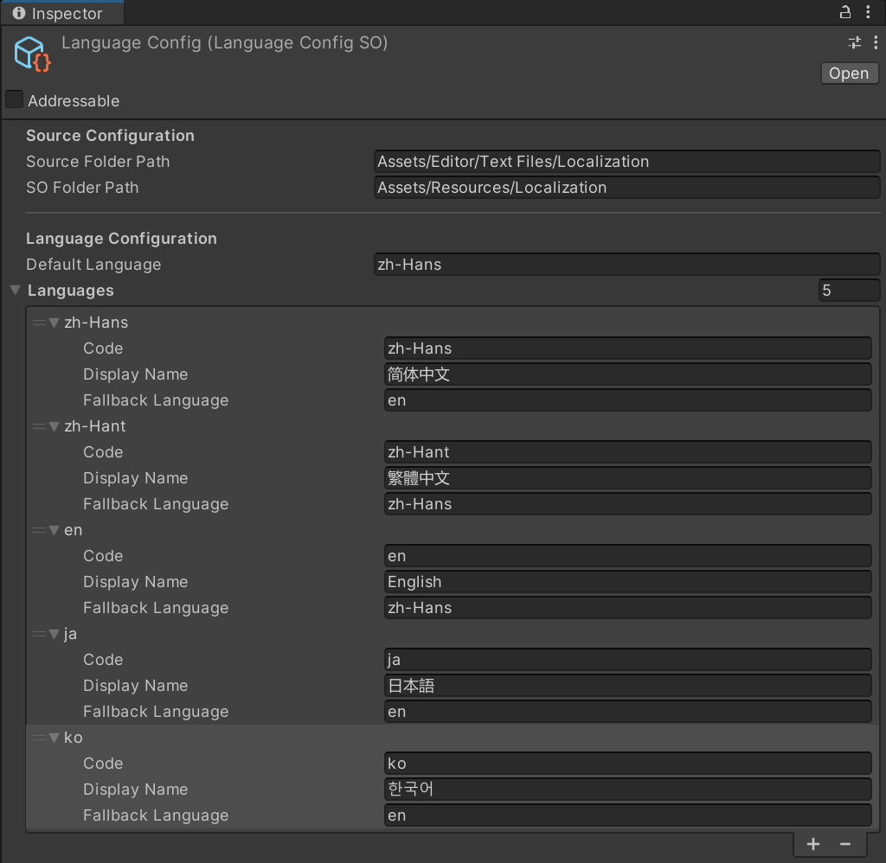

# Localization for Unity

[](CHANGELOG.md)
[](https://unity.com/releases/editor/archive)
[](https://docs.unity3d.com/Packages/com.unity.addressables@1.22/manual/index.html)
[](LICENSE.md)

**English** | [简体中文](README.zh-CN.md)

This package, developed by Dotline (Author Avlorayne), automates localization work across both the Unity Editor and the Unity Runtime (Unity 2022.3 or newer).

Workflow and responsibilities:

- Designers maintain multilingual text in Excel/CSV sheets.
- Programmers fetch text in code with `<UI|KEY>` templates.
- The Editor tooling in this package converts source sheets into Unity assets in one click, validates keys, resolves arguments and nested templates, and registers Addressables automatically.

How it works:

```
Designer edits Excel/CSV → one-click convert in Unity → LanguageDataSO generated and registered to Addressables → programmer fetches text with <UI|KEY>
```

Key features:

- **One-click conversion** — Excel/CSV source sheets are converted into `LanguageDataSO` assets inside Unity; incremental hashing means only changed sheets are re-converted.
- **Key validation** — duplicate keys and illegal content are caught at conversion time, before they can reach the game.
- **Template system** — `<UI|KEY>` lookups support arguments and nesting, resolved at runtime.
- **Automatic Addressables registration** — validated assets enter the `Localization` group with no manual setup.
- **Fallback languages** — each language may define one fallback language, followed by a configurable default language.

## Installation

Requires **Unity 2022.3** or newer; `com.unity.addressables` 1.22.3 is resolved automatically. The project must have Addressables initialized (open **Window → Asset Management → Addressables → Groups** once to generate the Settings asset); otherwise conversion cannot auto-register assets and logs a warning to the Console.

**Option 1 — Git URL (recommended)**: in the Package Manager click `+` → **Add package from git URL** and paste:

```
https://github.com/Avlorayne/Localization.git
```

Or add it to `Packages/manifest.json` directly:

```json
{
  "dependencies": {
    "com.dotline.localization": "https://github.com/Avlorayne/Localization.git"
  }
}
```

**Option 2 — Embedded package**: copy this folder into your project's `Packages/com.dotline.localization`; Unity picks it up without any manifest entry. To pin it explicitly:

```json
{
  "dependencies": {
    "com.dotline.localization": "file:com.dotline.localization"
  }
}
```

## Reading guide

Read by role:

| Role       | What you need                         | Time   |
| ---------- | ------------------------------------- | ------ |
| Designer   | [Designer guide](#designer-guide)     | 5 min  |
| Programmer | [Programmer guide](#programmer-guide) | 10 min |

***

## Designer guide

No code involved. Your daily routine is three steps:

1. Edit `.xlsx` or `.csv` files in the source folder (default `Assets/Editor/Text Files/Localization`);
2. In Unity, run **Tools → Localization → Convert Changed Source Files** (only converts sheets that changed);
3. Done. The generated text assets are registered to Addressables automatically and are immediately available to the programmers.


### How to fill in the sheet

The first row is the header: one `Key` column + one column per language + an optional `Comment` column.

| Key        | zh-Hans    | zh-Hant   | en         | ja            | ko       | Comment            |
| ---------- | ---------- | --------- | ---------- | ------------- | -------- | ------------------ |
| START_GAME | 开始游戏       | 開始遊戲      | Start Game | ゲーム開始         | 게임 시작    | Main menu button   |
| ITEM_COUNT | 共 {0} 个物品  | 共 {0} 個物品 | {0} items  | {0} 個のアイテム    | 아이템 {0}개 | Text with argument |

Rules (violations fail the conversion or raise errors):

- Use only uppercase letters, digits and underscores in `Key`, e.g. `START_GAME`; keys must be unique within a namespace — run **Tools → Localization → Validate Duplicate Keys** for a full check.
- Language column headers accept either language codes or display names, e.g. `zh-Hans`, `简体中文`. Which languages the project supports is decided by `LanguageConfigSO` — confirm with a programmer before adding one.
- The comment column header can be `Comment`, `Note`, `备注`, etc. Comments are for the team only and never reach the game.
- **Never put a `<UI|...>` placeholder inside a content of a language** — the editor treats that as a fatal error. To reference another entry, use a template (next section).

### Template syntax (designers, read this)

A template is a "text lookup placeholder" written inside content; the game replaces it with the final text at runtime. The syntax is always `<namespace|KEY>`:

| What you write                                | What it shows            | Meaning                                                             |
| --------------------------------------------- | ------------------------ | ------------------------------------------------------------------- |
| `<UI\|START_GAME>`                            | Start Game               | Basic reference: `UI` is the namespace, `START_GAME` is the key     |
| `<UI\|ITEM_COUNT(3)>`                         | 3 items                  | With argument: `{0}` in the sheet is replaced by 3                  |
| `<UI\|WELCOME(<UI\|PLAYER_NAME>)>`            | Welcome, Captain         | Nested: the inner template resolves first, then feeds the outer one |
| `<UI\|WELCOME(<UI\|PLAYER_NAME>, "Captain")>` | Welcome, Captain Captain | Text arguments must be wrapped in double quotes                     |

- Separate multiple arguments with commas; `{0}`, `{1}`, … are replaced in order.
- Ordinary TextMesh Pro rich text (e.g. `<color=red>`) is never treated as a template.

### Emergency: editing generated assets directly

The generated `LanguageDataSO` assets can be searched, added, edited and deleted right in the Inspector, with built-in duplicate-key and invalid-content validation.

**Note: anything you edit directly in the asset is overwritten the next time its source sheet is converted.** For lasting changes, edit the sheet; only assets whose source file was deleted stay untouched.


### Menu reference

| Menu                                                | When to use                                                                                    |
| --------------------------------------------------- | ---------------------------------------------------------------------------------------------- |
| Tools → Localization → Convert Changed Source Files | Everyday use after editing sheets; converts only what changed                                  |
| Tools → Localization → Convert All Source Files     | After config changes or when in doubt; forces a full reconvert                                 |
| Tools → Localization → Validate Duplicate Keys      | Full duplicate-key check                                                                       |
| Tools → Localization → Open Language Config         | Opens the language config (adding languages or changing folders is usually a programmer's job) |

***

## Programmer guide

### First-time configuration

Run **Tools → Localization → Open Language Config** to create or open `Assets/Settings/LanguageConfig.asset`:



| Field              | Default                                 | Description                                                                                                                                 |
| ------------------ | --------------------------------------- | ------------------------------------------------------------------------------------------------------------------------------------------- |
| `sourceFolderPath` | `Assets/Editor/Text Files/Localization` | Source sheet folder; scanned recursively.                                                                                                   |
| `soFolderPath`     | `Assets/Resources/Localization`         | Output folder for generated `LanguageDataSO` assets.                                                                                        |
| `defaultLanguage`  | `zh-Hans`                               | Primary fallback: the final resort when a key is missing in the current language.                                                           |
| `languages`        | `zh-Hans`, `zh-Hant`, `en`, `ja`, `ko`  | Language column definitions; drives sheet headers, import/export and the Inspector. Each entry can define one `fallbackLanguage`. |

### Conversion & Addressables

- The converter hashes both source file and asset and converts incrementally — day to day, only changed sheets are processed.
- When a source file is deleted, the converter only cleans up its hash record and keeps the corresponding `LanguageDataSO`, so hand-maintained data is never lost.
- Validated `LanguageDataSO` assets are **registered automatically** into the `Localization` Addressables group with address = `NamespaceId` (or the asset name when empty). Keep `NamespaceId` = asset name and no manual setup is needed.

### Runtime API

```csharp
using Localization;
using UnityEngine;

public sealed class LocalizedLabelExample : MonoBehaviour
{
    [SerializeField] private LanguageConfigSO languageConfig;

    private LocalizationSystem localization;

    private void Awake()
    {
        localization = new LocalizationSystem(languageConfig);
        localization.SetLanguage("en");
        Debug.Log(localization.GetLocalizedText("<UI|START_GAME>"));
        localization.OnLanguageChanged += RefreshAllTexts; // refresh UI after switching language
    }
}
```

- `GetLocalizedText(string template)` is a synchronous lookup supporting arguments and nested templates. Quoted text arguments are passed through as-is; interpolate dynamic values into the template with C# string interpolation:
  ```csharp
  string name = "William";
  localization.GetLocalizedText($"<UI|WELCOME(<UI|PLAYER_NAME>, \"{name}\")>");
  ```
- Runtime address resolution accepts the namespace name, the `Localization/<name>` convention, and the default `Assets/Resources/Localization/<name>.asset` path. With the default settings you don't need to manage these addresses manually.
- Hook UI refresh logic to `LocalizationSystem.OnLanguageChanged`.

### WebGL notes

The current public API exposes synchronous lookup only. WebGL cannot block on Addressables loads, so the first lookup of an uncached namespace is not supported by this release. Avoid calling `GetLocalizedText` for uncached data on WebGL; supporting that flow requires a future public asynchronous/preload API.

### Troubleshooting quick reference

| Symptom                           | Fix                                                                                                                                                                                                           |
| --------------------------------- | ------------------------------------------------------------------------------------------------------------------------------------------------------------------------------------------------------------- |
| Wrong or empty text               | Check the template's namespace matches `NamespaceId` (or the asset name) and the key spelling; then confirm the language column exists — missing keys fall back along `fallbackLanguage` → `defaultLanguage`. |
| Adding a new language             | Programmer adds a language definition to `LanguageConfig.languages`, the designer adds the matching column to the sheet header, then Convert All.                                                             |
| Empty lookups on WebGL first load | The current public API has no asynchronous/preload entry point; do not query an uncached namespace on WebGL in this release.                                                                         |

***

## Documentation

| Document                                            | Contents                                              |
| --------------------------------------------------- | ----------------------------------------------------- |
| [Configuration.md](Documentation~/Configuration.md) | Configuration fields, source file format, path rules. |
| [Architecture.md](Documentation~/Architecture.md)   | Runtime/editor architecture and data flow.            |
| [Runtime.zh-CN.md](Documentation~/Runtime.zh-CN.md) | In-depth runtime guide: every Runtime type, template parsing and fallback rules (Simplified Chinese). |
| [Testing.md](Documentation~/Testing.md)             | Automated tests and manual acceptance cases.          |
| [FAQ.md](Documentation~/FAQ.md)                     | Frequently asked questions.                           |

## Sample

Import **Basic Localization Example** from the Samples section of the package in the Package Manager. You get a minimal CSV source file and the `BasicLocalizationExample` scripts, demonstrating configuration, conversion, and runtime lookup.

## Known limitations

- The current public API is synchronous, so WebGL cannot query an uncached namespace on first use. A public asynchronous/preload API is required for that scenario.
- When a source file is deleted, the converter only cleans up its hash record and keeps the corresponding `LanguageDataSO`, protecting manually maintained data.
- The package embeds third-party binaries; keep `Third Party Notices.md` together with the package when redistributing.

## License

MIT — see [LICENSE.md](LICENSE.md). Third-party libraries are covered by [Third Party Notices.md](Third%20Party%20Notices.md).
