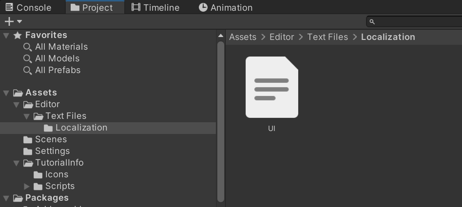
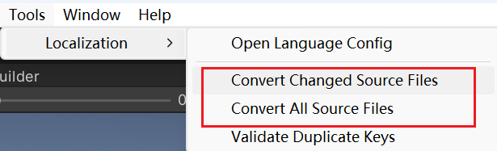
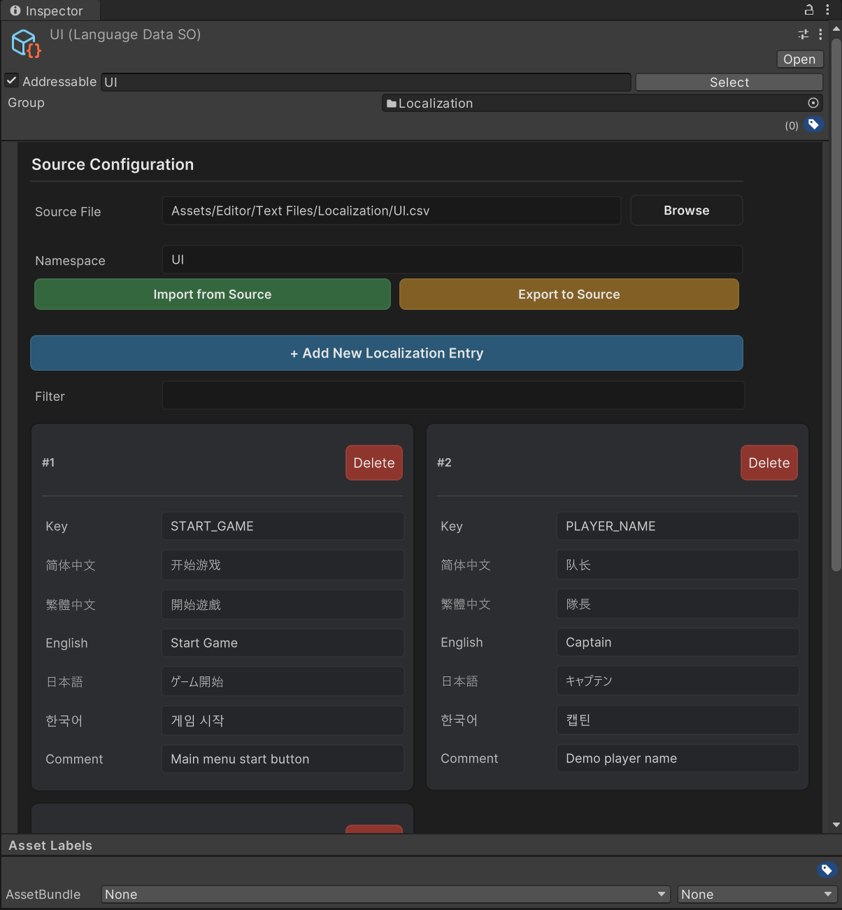
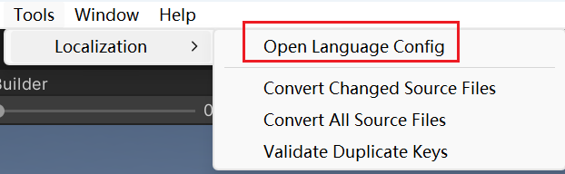
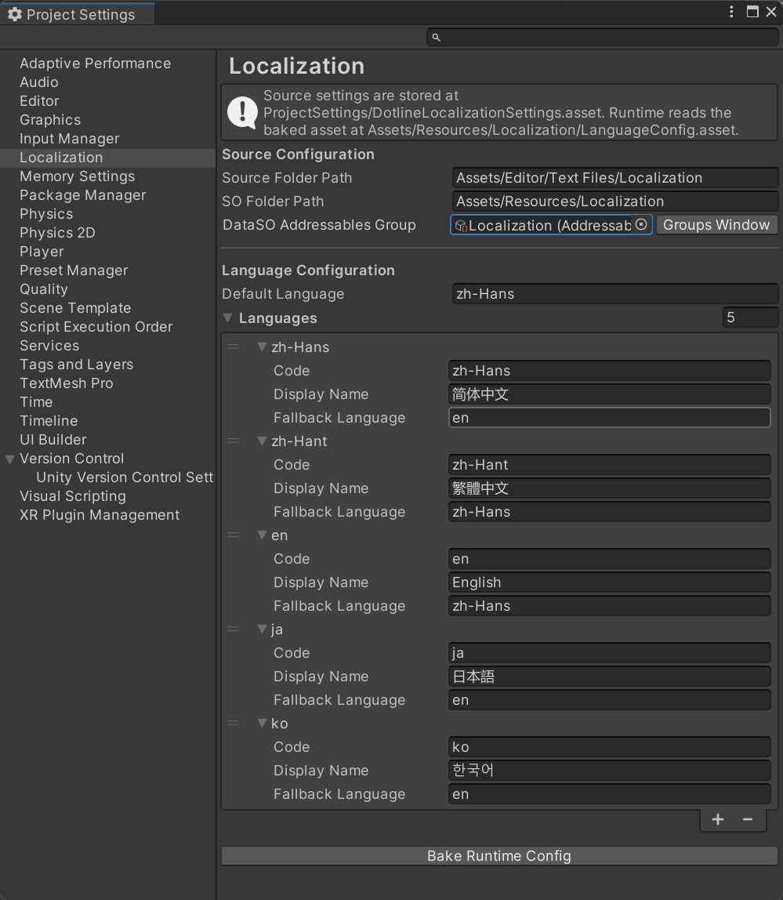

# Unity 本地化包（Localization）

[](CHANGELOG.md)
[](https://unity.com/releases/editor/archive)
[](https://docs.unity3d.com/Packages/com.unity.addressables@1.22/manual/index.html)
[](LICENSE.md)

[English](README.md) | **简体中文**

本包是 Dotline 开发（作者 Avlorayne）的基于 Unity 2022.3.62 的本地化组件，在 Unity Editor 和 Unity Runtime 均有自动化工作，流程化与灵活性高。

基本流程与分工如下：

- 策划在 Excel/CSV 表里维护多语言文本，
- 程序在代码里用 `<UI|KEY>` 模板取文本。
- 本包开发的 Editor 组件负责把源表一键转换成 Unity 资产、校验 Key、解析参数与嵌套模板，并自动注册 Addressables。

大致流程：

```
策划填 Excel/CSV → Unity 菜单一键转换 → 自动生成 LanguageDataSO 并注册 Addressables → 程序在代码里用 <UI|KEY> 取文本
```

主要特点：

- **一键转换** — Excel/CSV 源表在 Unity 里一键转成 `LanguageDataSO` 资产；按哈希做增量转换，只处理改过的表。
- **Key 校验** — 重复 Key 和非法内容在转换阶段就被拦截，不会带进游戏。
- **模板系统** — 运行时解析 `<UI|KEY>` 取词，支持参数和嵌套模板。
- **自动注册 Addressables** — 通过校验的资产自动进入 `Localization` 分组，无需手动配置。
- **多语言回退** — 每种语言可单独设置一级回退语言，之后再尝试可配置的默认语言。

## 安装

需要 **Unity 2022.3** 或更高版本；`com.unity.addressables` 1.22.3 会自动解析依赖。项目需已初始化 Addressables（打开过 **Window → Asset Management → Addressables → Groups** 生成 Settings 资产），否则转换时无法自动注册资产，会在 Console 提示。

**方式一 — Git URL（推荐）**：在 Package Manager 点击 `+` → **Add package from git URL**，粘贴：

```
https://github.com/Avlorayne/Localization.git#1.0.4
```

或直接在 `Packages/manifest.json` 中添加：

```json
{
  "dependencies": {
    "com.dotline.localization": "https://github.com/Avlorayne/Localization.git#1.0.4"
  }
}
```

**方式二 — 内嵌包**：将本目录复制到目标项目的 `Packages/com.dotline.localization`，Unity 自动识别，无需在 manifest 中声明。如需显式引用：

```json
{
  "dependencies": {
    "com.dotline.localization": "file:com.dotline.localization"
  }
}
```

## 阅读指南

按角色读，各取所需：

| 角色 | 只需要读          | 大约耗时  |
| -- | ------------- | ----- |
| 策划 | [策划指南](#策划指南) | 5 分钟  |
| 程序 | [程序指南](#程序指南) | 10 分钟 |

***

## 策划指南

不需要写任何代码。日常就是三步：

1. 在源表目录（默认 `Assets/Editor/Text Files/Localization`）里编辑 `.xlsx` 或 `.csv`；
2. 回到 Unity，执行 **Tools → Localization → Convert Changed Source Files**（只转换改过的表）；
3. 完成。生成的文本资产会自动进入 Addressables，程序那边立即可用。

  
  
  

### 表格怎么填

第一行是表头：一个 `Key` 列 + 每种语言一列 + 可选的 `Comment` 列。

| Key        | zh-Hans    | zh-Hant   | en         | ja            | ko       | Comment |
| ---------- | ---------- | --------- | ---------- | ------------- | -------- | ------- |
| START_GAME | 开始游戏       | 開始遊戲      | Start Game | ゲーム開始         | 게임 시작    | 主菜单按钮   |
| ITEM_COUNT | 共 {0} 个物品  | 共 {0} 個物品 | {0} items  | {0} 個のアイテム    | 아이템 {0}개 | 带参数文本   |

规则（违反会导致转换失败或报错）：

- `Key` 推荐只用大写字母、数字、下划线，如 `START_GAME`；同一命名空间内不能重复，可用 **Tools → Localization → Validate Duplicate Keys** 全量检查。
- 语言列表头写语言代码或显示名都行，如 `zh-Hans`、`简体中文`。项目支持哪些语言由 **Project Settings → Localization** 配置，加新语言前先和程序确认。
- 注释列表头可写 `Comment`、`Note`、`备注` 等，内容只给团队看，不会进游戏。
- **语言内容里不要再写** **`<UI|...>`** **占位符**，编辑器会视为致命错误。要引用别的条目，请写在模板里（见下节）。

### 模板语法（策划必读）

模板是写在文本里的“取词占位符”，游戏运行时会把它替换成对应文本。语法一律是 `<命名空间 | KEY (args[]) >`：

| 你写的模板                                         | 最终显示                     | 说明                                 |
| --------------------------------------------- | ------------------------ | ---------------------------------- |
| `<UI\|START_GAME>`                            | Start Game               | 基本引用：`UI` 是命名空间，`START_GAME` 是 Key |
| `<UI\|ITEM_COUNT(3)>`                         | 3 items                  | 带参数：表里的 `{0}` 会被替换成 3              |
| `<UI\|WELCOME(<UI\|PLAYER_NAME>)>`            | Welcome, Captain         | 嵌套：先解析里面的模板，再把结果传进外层               |
| `<UI\|WELCOME(<UI\|PLAYER_NAME>, "Captain")>` | Welcome, Captain Captain | 文本参数必须用英文双引号包住                     |

- 多个参数用英文逗号分隔，`{0}`、`{1}` 按顺序替换。
- 普通 TextMesh Pro 富文本（如 `<color=red>`）不会被当成模板，放心使用。

### 应急：直接改生成的资产

转换生成的 `LanguageDataSO` 资产在 Inspector 里可以直接搜索、新增、修改、删除条目，自带重复 Key 和非法内容校验。

**注意：直接改资产的内容，下次转换同一张源表时会被覆盖。** 要长期生效，请改源表；只有源表已删除的资产才不会被动到。如果要保持一致性，可以在修改后点击**导出到源文件**。


### 常用菜单

| 菜单                                                  | 什么时候用                  |
| --------------------------------------------------- | ---------------------- |
| Tools → Localization → Convert Changed Source Files | 日常改完表后用，只转换有变动的表       |
| Tools → Localization → Convert All Source Files     | 改了配置或怀疑有遗漏时，强制全部重转     |
| Tools → Localization → Validate Duplicate Keys      | 全量检查重复 Key             |
| Tools → Localization → Open Language Config         | 打开 Project Settings 里的语言配置（加语言、改目录一般由程序操作） |
| Tools → Localization → Bake Runtime Language Config | 手动把 Project Settings 配置烘焙到运行时 `Resources` 资产 |

***

## 程序指南

### 首次配置

执行 **Tools → Localization → Open Language Config**，打开 **Project Settings → Localization**。
配置时需要选择`Addressables Group`，配置完成后，有效的`Localization Data SO`资源会被自动放入组中。




配置源文件保存在 `ProjectSettings/DotlineLocalizationSettings.asset`，不放在 `Assets` 下，避免被资源清理误删。运行时读取其烘焙产物 `Assets/Resources/Localization/LanguageConfig.asset`：Project Settings 页面修改配置、转换源表、进入 Play Mode、构建 Player 前都会创建或刷新这份运行时副本，也可以手动执行 **Tools → Localization → Bake Runtime Language Config**。

| 字段                 | 默认值                                     | 说明                                                         |
| ------------------ | --------------------------------------- | ---------------------------------------------------------- |
| `sourceFolderPath` | `Assets/Editor/Text Files/Localization` | 源表目录，转换器递归扫描。                                              |
| `soFolderPath`     | `Assets/Resources/Localization`         | 生成 `LanguageDataSO` 的目录；运行时 `LanguageConfig.asset` 固定烘焙到 `Assets/Resources/Localization`。 |
| `defaultLanguage`  | `zh-Hans`                               | 主兜底语言：当前语言缺词时最终回退到这里。                                      |
| `languages`        | `zh-Hans`、`zh-Hant`、`en`、`ja`、`ko`      | 语言列定义，驱动表头、导入导出和 Inspector；每项可单独设置一个 `fallbackLanguage`。 |

### 转换与 Addressables

- 转换器按“源文件哈希 + 资产哈希”做增量转换，日常只转改过的表。
- 每次转换前会先烘焙运行时 `LanguageConfig.asset`，确保 Player 侧拿到最新语言配置。
- 源文件被删除时，转换器只清理哈希记录并保留对应 `LanguageDataSO`，不误删手工维护的数据。
- 通过校验的 `LanguageDataSO` 会被**自动注册**到 Addressables 的 `Localization` 分组，地址 = `NamespaceId`（为空时用资产名）。保持 `NamespaceId` = 资产名即可，无需手动配置。

### 运行时 API

`LocalizationSystem` 现在通过无参构造函数构建。首次使用时，它会从 `Resources/Localization/LanguageConfig` 自动加载烘焙后的运行时配置，调用方不需要传入或序列化 `LanguageConfigSO`。

```csharp
using Localization;
using UnityEngine;

public sealed class LocalizedLabelExample : MonoBehaviour
{
    private LocalizationSystem localization;

    private void Awake()
    {
        localization = new LocalizationSystem();
        if (!localization.IsReady)
            return;

        localization.CurrentLanguageCode = "en";
        Debug.Log($"Language: {localization.CurrentLanguageCode}");
        Debug.Log(localization.GetLocalizedText("<UI|START_GAME>"));
        localization.OnLanguageChanged += RefreshAllTexts; // 切换语言后刷新 UI
    }

    private void OnDestroy()
    {
        if (localization != null)
            localization.OnLanguageChanged -= RefreshAllTexts;
    }

    private void RefreshAllTexts()
    {
        Debug.Log(localization.GetLocalizedText("<UI|START_GAME>"));
    }
}
```

- `GetLocalizedText(string template)` 为同步取词，支持参数、嵌套模板。引号内的文本参数原样传递，动态值用 C# 字符串插值拼进模板即可：
  ```csharp
  string name = "William";
  localization.GetLocalizedText($"<UI|WELCOME(<UI|PLAYER_NAME>, \"{name}\")>");
  ```
- 运行时会按命名空间名、`Localization/<name>` 约定和默认的 `Assets/Resources/Localization/<name>.asset` 路径解析地址。按默认配置使用时无需手动管理这些地址。
- Basic Localization sample 会用场景级 `BasicLocalizationExample` 门面包装同样的 `LocalizationSystem` 构建方式，方便快速演示 UI。

### WebGL 注意

当前公开 API 只有同步取词。WebGL 不能同步等待 Addressables 加载，所以本版本不支持首次查询未缓存命名空间。WebGL 上不要对未缓存数据调用 `GetLocalizedText`；要支持该流程需要未来提供公开的异步/预加载 API。

### 常见问题速查

| 现象            | 处理                                                                                                        |
| ------------- | --------------------------------------------------------------------------------------------------------- |
| 取出来的词不对或为空    | 先检查模板的命名空间是否与 `NamespaceId`（或资产名）一致、Key 是否拼写正确；再确认该语言列存在，缺词时会沿 `fallbackLanguage` → `defaultLanguage` 回退。 |
| 想加一门新语言       | 程序在 **Project Settings → Localization** 的 `languages` 里添加语言定义，策划在表头加对应列，然后 Convert All。                                          |
| WebGL 上首次取词为空 | 当前公开 API 没有异步/预加载入口，本版本不要在 WebGL 上首次查询未缓存命名空间。                                                                                 |

***

## 文档

| 文档                                           | 内容                       |
| -------------------------------------------- | ------------------------ |
| [配置](Documentation~/Configuration.zh-CN.md)  | 配置项、源文件格式、路径规则。          |
| [系统架构](Documentation~/Architecture.zh-CN.md) | Runtime / Editor 架构与数据流。 |
| [运行时技术说明](Documentation~/Runtime.zh-CN.md) | Runtime 全部代码职责、模板解析与回退规则详解。 |
| [测试用例](Documentation~/Testing.zh-CN.md)      | 自动化测试与人工验收用例。            |
| [报错与警告条例](Documentation~/LocalizationErrorWarningRules.zh-CN.md) | 错误、警告、弹窗与前端 Editor 处理策略。 |
| [FAQ](Documentation~/FAQ.zh-CN.md)           | 常见问题。                    |

## 示例

在 Package Manager 的包详情页 Samples 区域导入 **Basic Localization Example**。导入后会得到一个最小 CSV 源文件和 `BasicLocalizationExample` 脚本，演示配置、转换与运行时查询。

导入后的示例工程包含：

- `SampleScene`：已经挂载 `BasicLocalizationExample` 和文本示例组件。
- `UI.csv`：最小化本地化源文件。
- `Resources/Localization/LanguageConfig.asset`：`LocalizationSystem` 自动加载的运行时烘焙配置副本；项目级源配置仍以 **Project Settings → Localization** 为准。

使用步骤：

1. 执行 **Tools → Localization → Open Language Config**，打开 **Project Settings → Localization**。
2. 将 `sourceFolderPath` 指向导入后 `UI.csv` 所在目录；将 `soFolderPath` 保持为 `Assets/Resources/Localization` 或项目约定的输出目录。
3. 确认宿主项目已经初始化 Addressables，然后执行 `Tools/Localization/Convert All Source Files`。
4. 打开 `SampleScene` 并运行。生成的本地化资源会自动加入 `Localization` Addressables 分组。

`BasicLocalizationExample` 为场景脚本提供了简单的单例入口：

```csharp
BasicLocalizationExample localization = BasicLocalizationExample.Instance;
localization.SetLanguage("en");

bool ready = localization.IsReady;
string languageCode = localization.GetLanguageCode();
string text = localization.GetLocalizedText("<UI|START_GAME>");

localization.AddListener(RefreshTexts);
// 不再需要时移除同一个回调：
// localization.RemoveListener(RefreshTexts);
```

运行时配置由 Project Settings 烘焙到 `Assets/Resources/Localization/LanguageConfig.asset`，`LocalizationSystem` 会自动通过 `Resources` 加载这份运行时配置。

## 已知限制

- 当前公开 API 为同步取词，WebGL 上首次查询未缓存命名空间不受支持；该场景需要公开的异步/预加载 API。
- 源文件被删除时，转换器只清理哈希记录并保留对应 `LanguageDataSO`，保护手工维护的数据。
- 包内嵌了第三方二进制依赖，重新分发时请保留 `Third Party Notices.md`。

## 许可证

MIT 许可证，详见 [LICENSE.md](LICENSE.md)。第三方库的许可见 [Third Party Notices.md](Third%20Party%20Notices.md)。
